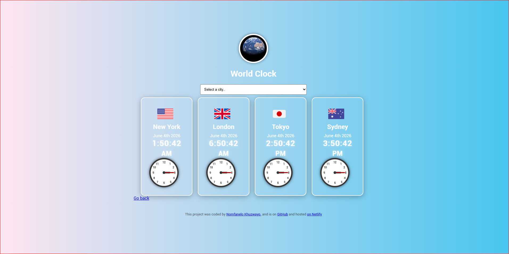

# 🌍 World Clock Project

A responsive web application that displays the current time and date for multiple cities around the world. Built with **HTML, CSS, JavaScript**, and enhanced with **Moment.js** and **Moment Timezone** for accurate time zone handling.

---

## ✨ Features
- Interactive **world clock** with analog and digital displays.
- Displays time and date for major cities: New York, London, Tokyo, Sydney, and user’s current location.
- **Dropdown selector** to choose and add cities dynamically.
- **Animated background video** for a modern UI experience.
- Flags for each city to enhance visual identity.
- Responsive design for desktop and mobile devices.
- Footer with project credits and GitHub/Netlify links.

---

## 🛠️ Technologies Used
- **HTML5** – structure and semantic layout  
- **CSS3** – styling and responsive design  
- **JavaScript (ES6)** – dynamic functionality  
- **Moment.js & Moment Timezone** – time zone calculations  
- **Font Awesome** – icons  
- **Netlify** – deployment and hosting  

---

## 🚀 Deployment
The project is live and hosted on **Netlify**:  
👉 [World Clock Project](https://world-clock10.netlify.app/)

Source code is available on GitHub:  
👉 [GitHub Repository](https://github.com/NO-MM/World-Clock-Project)

---

## 📂 Project Structure
World-Clock-Project/
│
├── index.html          # Main HTML file
├── css/
│   └── style.css       # Stylesheet
├── JavaScript/
│   └── Java.js         # Core functionality
├── gallery/
│   ├── images/         # Flags and visuals
│   └── videos/         # Background video
└── README.md           # Project documentation

---

## 👩‍💻 Author
This project was coded by **Nomfanelo Khuzwayo**.  
- GitHub: [NO-MM](https://github.com/NO-MM)  
- Hosted on: [Netlify](https://world-clock10.netlify.app/)  

---

## 📌 Future Improvements
- Add more cities dynamically via API integration.  
- Dark/light mode toggle.  
- User customization for preferred cities.  
- Enhanced animations for clock hands.  

